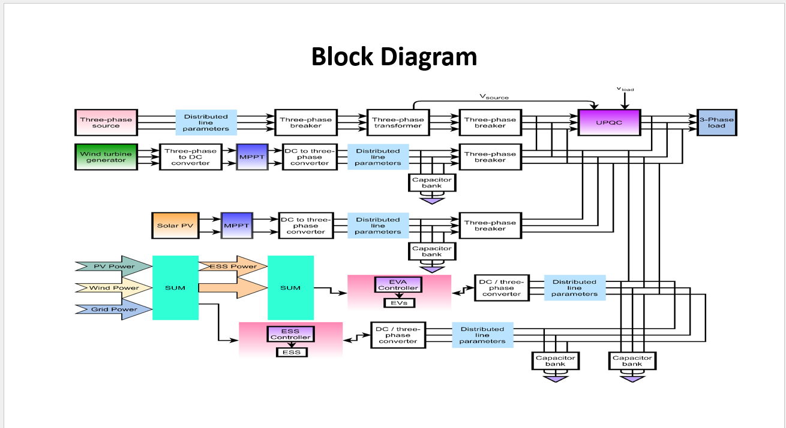
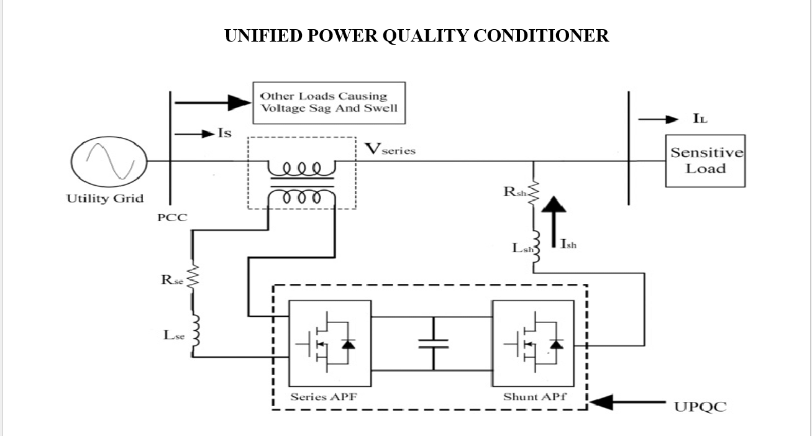
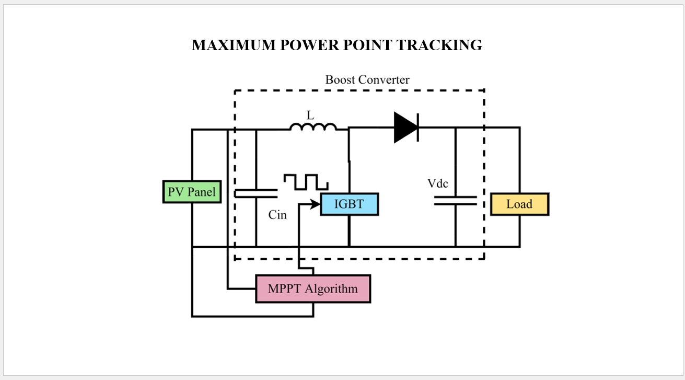

# Power Enhancement with Grid Stabilization of Renewable Energy-Based Generation System Using UPQC-FLC-EVA Technique

## Overview
This project focuses on improving power quality and grid stability in renewable energy systems using a Unified Power Quality Conditioner (UPQC), Fuzzy Logic Controller (FLC), and EV Integration.

The system integrates:
- Solar PV System
- Wind Energy System
- Energy Storage System (ESS)
- Electric Vehicles (EVs)
- UPQC-based Power Quality Improvement

## Tools Used
- MATLAB
- Simulink
- Power Electronics
- Fuzzy Logic Control

## Project Files
- Project Presentation
- Project Documentation
- Simulink Model Screenshot

## Objectives
- Improve grid voltage stability
- Reduce Total Harmonic Distortion (THD)
- Manage renewable energy integration
- Improve power quality using UPQC
## Block Diagram
![Simulink Model(Simulink_Model.png)]

## Author
Karthik
